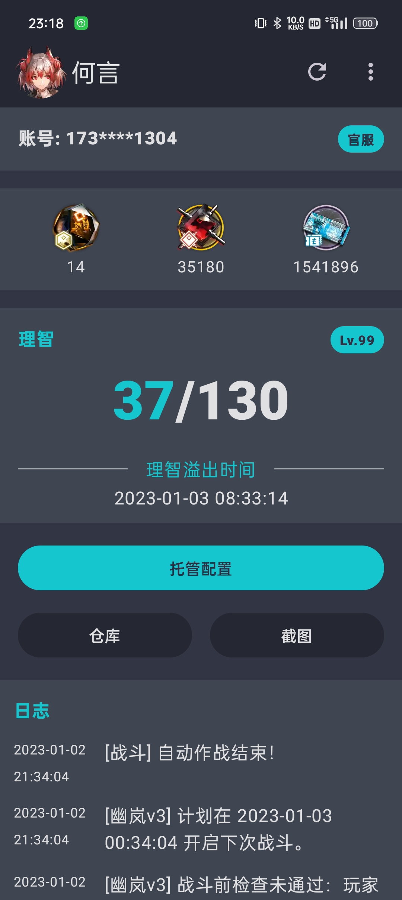
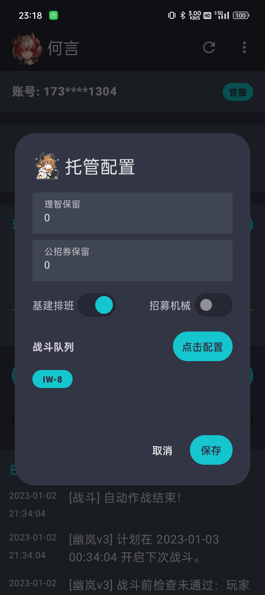
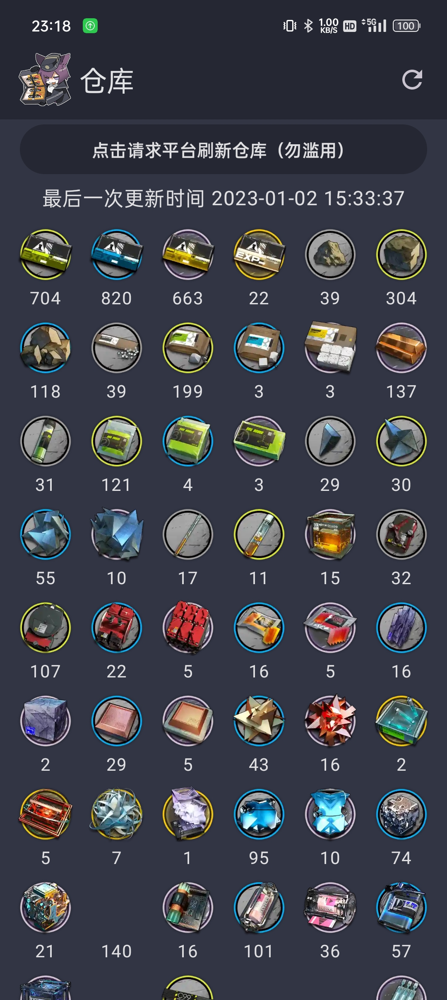
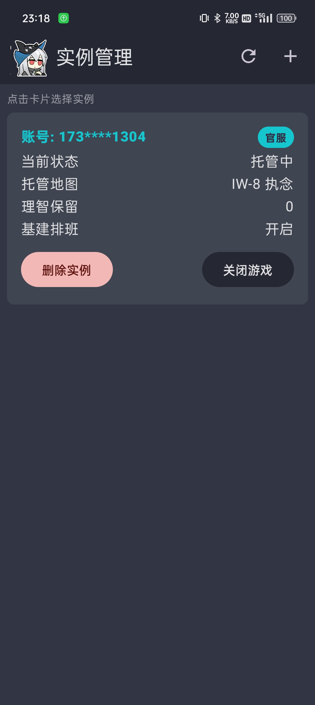
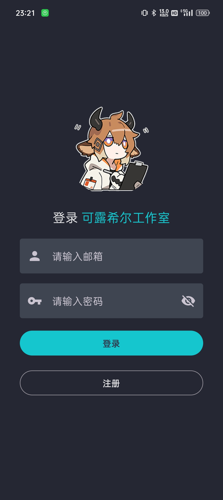

# Closure 方舟云托管平台

* 云托管能力由 可露希尔工作室提供，我只是个臭写客户端的
* 可露希尔工作室 Github: https://github.com/closure-studio/ReadMe
* 网页端： https://arknights.host/

* app 下载地址：https://install.appcenter.ms/users/heyanle/apps/closure/distribution_groups/closuregroup

### 目前功能：
* 登录注册
* 游戏实例管理（添加删除启动关闭实例）
* 滑动验证
* 报表数据（理智，龙门币，合成玉，源石）
* 托管日志
* 托管配置（配置基建换班，刷理智关卡等）
* 不定时截图查看
* 仓库查看

### TODO：
* 公告支持（是可露希尔工作室的公告，不是游戏公告）
* 停服维护支持（现在如果可露希尔工作室维护，该 app 直接会网络错误，不会展示维护）

### 截图：

